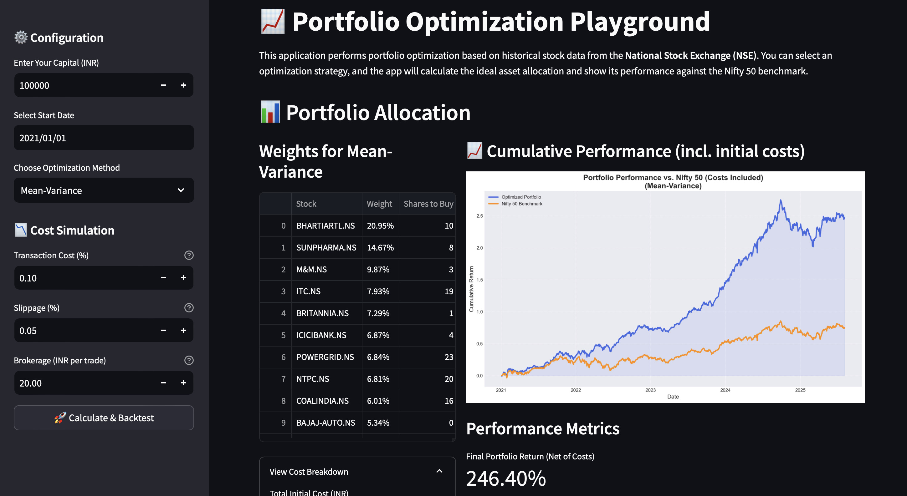
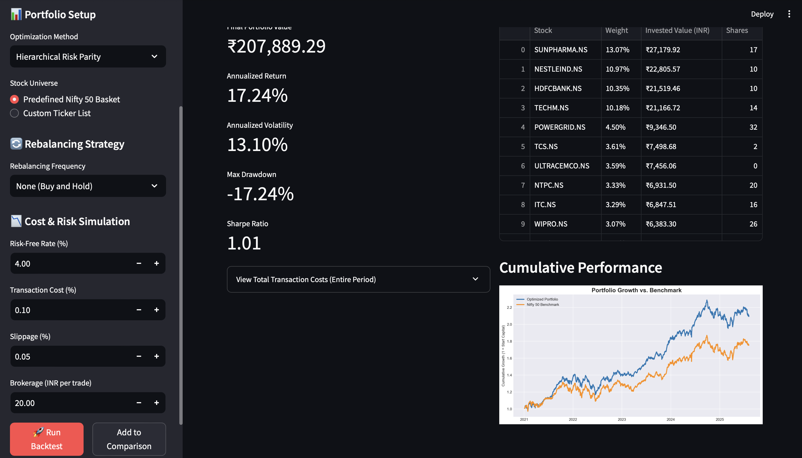

 <!-- Optional: Add a logo here if you have one -->
<h1 align="center">📈 Portfolio Optimization Playground</h1>

A dynamic web application for backtesting and comparing modern portfolio optimization strategies on Indian stock market data.
 
<a href="#-features"><strong>Features</strong></a>
·
<a href="#-screenshots"><strong>Screenshots</strong></a>
·
<a href="#-setup--installation"><strong>Setup</strong></a>

 

<!-- ABOUT THE PROJECT -->

📋 About The Project
This application provides a hands-on environment to explore financial portfolio theory. It fetches live stock data, applies sophisticated optimization algorithms, and simulates performance against the Nifty 50 benchmark, all while accounting for real-world trading costs.

✨ Features
Four Optimization Models: Compare the performance of:

Mean-Variance: The classic Markowitz model.

Risk Parity: Aims for equal risk contribution from each asset.

Hierarchical Risk Parity (HRP): A modern, machine-learning-based approach.

Equally Weighted: A simple, yet effective, baseline strategy.

Realistic Cost Simulation: Accurately models initial investment costs, including:

Brokerage Fees

Transaction Taxes (STT)

Execution Slippage

Dynamic Backtesting: Select any historical start date to run a simulation up to the present day.

In-Depth Performance Analysis: Get key metrics like cumulative returns and annualized volatility.

Interactive & Polished UI: Built with Streamlit for a smooth user experience.

🖼️ Screenshots

<i>Main dashboard showing performance chart and allocation details.</i>

  

<i>Configuration sidebar with cost simulation options.</i>

🛠️ Setup & Installation
To get a local copy up and running, follow these simple steps.

Prerequisites

Python 3.8+

Pip (Python package installer)

Installation

Clone the repository:

git clone [https://github.com/Abhinaba925/portfolio-optimization-playground.git](https://github.com/Abhinaba925/portfolio-optimization-playground.git)
cd portfolio-optimization-playground

Install the required packages:

pip install -r requirements.txt

Run the Streamlit app:

streamlit run app.py

The application will open in your default web browser.

🔧 Built With
This project was built using the following technologies:

<a href="https://scipy.org/" target=""

