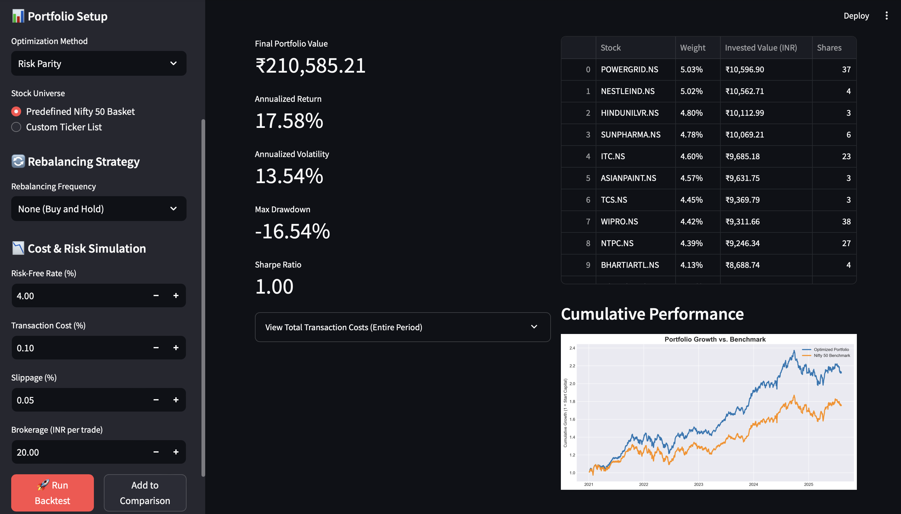

<div align="center">

  <h1 align="center">📈 Portfolio Optimization Playground 📈</h1>

  <p align="center">
    A sophisticated web application for backtesting and comparing modern portfolio optimization strategies on the Indian stock market.
    <br />
    <a href="#-about-the-project"><strong>About</strong></a> ·
    <a href="#-key-features"><strong>Features</strong></a> ·
    <a href="#-live-demo--screenshots"><strong>Demo & Screenshots</strong></a> ·
    <a href="#-how-to-run"><strong>Run Locally</strong></a>
  </p>

  <p align="center">
    
    
    
  </p>

</div>

---

### 📋 About The Project

The **Portfolio Optimization Playground** provides an intuitive, hands-on environment for both novice and experienced investors to explore financial portfolio theory. It fetches live stock data from the National Stock Exchange (NSE), applies a suite of sophisticated optimization algorithms, and simulates portfolio performance against the Nifty 50 benchmark.

What sets this project apart is its focus on realism, allowing users to factor in real-world costs like brokerage fees, transaction taxes, and execution slippage to get a true sense of a strategy's viability.

---

### ✨ Key Features

-   **Advanced Optimization Models**: Compare four distinct strategies:
    -   **Mean-Variance**: The classic Markowitz model for balancing risk and return.
    -   **Risk Parity**: Aims for equal risk contribution from each asset.
    -   **Hierarchical Risk Parity (HRP)**: A modern, machine-learning-based approach.
    -   **Equally Weighted**: A simple, yet effective, baseline.
-   **Dynamic Rebalancing Strategies**: Simulate a more active investment approach by choosing a rebalancing frequency (Monthly, Quarterly, or Annually).
-   **Comprehensive Performance Metrics**: Go beyond simple returns with advanced risk-adjusted metrics like the **Sharpe Ratio**, **Sortino Ratio**, and **Calmar Ratio**.
-   **Customizable Stock Universe**: Test strategies on the predefined Nifty 50 basket or **provide your own list of custom stock tickers**.
-   **Save & Compare Scenarios**: Run multiple backtests with different settings and **compare their performance charts and metrics side-by-side** in a single view.
-   **Realistic Cost Simulation**: Accurately models the total impact of brokerage, taxes, and slippage throughout the entire backtesting period.

---

### 📸 Live Demo & Screenshots

*(You can add a link to your deployed Streamlit Cloud app here)*

**`[ Live Demo Coming Soon ]`**

<br>

<table align="center">
  <tr>
    <td align="center"><b>Main Dashboard View with Advanced Metrics</b></td>
    <td align="center"><b>Strategy Comparison Dashboard</b></td>
  </tr>
  <tr>
    <td></td>
    <td></td>
  </tr>
</table>

---

### 🚀 How To Run

To get a local copy up and running, follow these simple steps.

#### Prerequisites

-   Python 3.8+ & Pip

#### Installation

1.  **Clone the repository:**
    ```sh
    git clone [https://github.com/Abhinaba925/portfolio-optimization-playground.git](https://github.com/Abhinaba925/portfolio-optimization-playground.git)
    cd portfolio-optimization-playground
    ```
2.  **Install the required packages:**
    ```sh
    pip install -r requirements.txt
    ```
3.  **Run the Streamlit app:**
    ```sh
    streamlit run app.py
    ```
    The application will automatically open in your default web browser.

---

### 🛠️ Technologies Used

This project leverages a powerful stack of data science and web development libraries:

| Technology                                                                                                  | Description                               |
| ----------------------------------------------------------------------------------------------------------- | ----------------------------------------- |
| **[Streamlit](https://streamlit.io/)** | Core web application framework            |
| **[yfinance](https://pypi.org/project/yfinance/)** | Downloading historical stock market data  |
| **[Pandas](https://pandas.pydata.org/)** | Data manipulation and analysis            |
| **[NumPy](https://numpy.org/)** | Numerical operations and linear algebra   |
| **[SciPy](https://scipy.org/)** | Scientific computing and optimization     |
| **[Matplotlib](https://matplotlib.org/)** | Data visualization and plotting           |

---

### 💡 Future Improvements

-   [ ] Add functionality to export backtest results (metrics, allocation) to a CSV file.
-   [ ] Incorporate sector constraints into the optimization models.
-   [ ] Visualize portfolio turnover and transaction costs over time.
-   [ ] Implement additional optimization models like Black-Litterman.

---

### 📄 License

Distributed under the MIT License. See `LICENSE` for more information.

---

### 📬 Contact

Abhinaba Ghosh - [Your LinkedIn Profile URL] - abhinaba.ghosh.925@gmail.com

Project Link: [https://github.com/Abhinaba925/portfolio-optimization-playground](https://github.com/Abhinaba925/portfolio-optimization-playground)

